# REPL C++ using dlopen

REPL C++即交互式的C++解释器。


## ubuntu中的使用方式
### 编译load.cpp
```shell
clang++ load.cpp -g -std=c++11 -ldl -shared -fPIC -o libload.so
```

### 使用repl
```
python CxxREPL.py
```
依次输入下面的内容进行验证。
```C++
int foo() { return 42; }
#include <stdio.h>
int a = foo();
printf("[#] in s2.cpp a=%d\n", a);
int& b=a;
++b;
#include <iostream>
#include <typeinfo>
std::cout<< "[#] a" << typeid(a).name() << ":" << a << std::endl;
std::cout<< "[#] b" << typeid(b).name() << ":" << b << std::endl;
void print() { std::cout << a << std::endl; }
print();
void print_b() { std::cout << b << std::endl; }
print_b();
#include <vector>
using namespace std;
vector<int> v={1,2,3};
#include <iostream>
cout << v[0] << endl;
v
```


### intuition
在src_intuition目录中放置了项目最初想法的测试代码。
编译为动态链接库
```shell
clang++ s1.cpp -g -std=c++11  -shared -fPIC -o libs1.so
clang++ s2.cpp -g -std=c++11  -shared -fPIC -o libs2.so
clang++ s3.cpp -g -std=c++11  -shared -fPIC -o libs3.so
clang++ s4.cpp -g -std=c++11  -shared -fPIC -o libs4.so
clang++ s5.cpp -g -std=c++11  -shared -fPIC -o libs5.so
```
使用main中调用
```shell
clang++ main.cpp -g -std=c++11 -rdynamic -ldl -o main
```